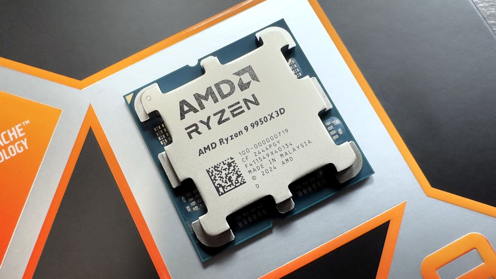

# AMD Ryzen 9 9950X3D

## Details
- **Link:** [Product Page](https://www.amd.com/en/products/processors/desktops/ryzen/9000-series/amd-ryzen-9-9950x3d.html)
- **Price:** S$862 (from [amazon link](https://www.amazon.sg/AMD-9950X-Processor-Unbridled-Architecture/dp/B0D6NNRBGP/?th=1))

## Why Selected
- 3D V-cache
- High core amount provides excellent performance in productivity tasks
- Future-proof as it is using the latest AM5 socket
- Most powerful AMD Ryzen CPU

## Specifications
- Cores/Threads: 16/32
- Base/Max Boost Clock: 4.3 GHz / 5.7 GHz
- TDP: 170W
- Socket: AM5

---

## Considered Competitors

### AMD Ryzen 7 9800X3D
- **Link**: [Product Page](https://www.amd.com/en/products/processors/desktops/ryzen/9000-series/amd-ryzen-7-9800x3d.html)
- - **Price**: S$615.44
- **Cores/Threads:** 8/16
- **Base/Max Boost Clock:** 4.7 GHz / 5.2 GHz
- **TDP:** 120W
- **Socket:** AM5
- **Pros:** Excellent CPU for gaming with 3D V-cache, relatively low TDP
- **Cons:** Not so great for productivity due to the lack of cores
- **Reasoning:** Great pick for gaming, but not picked as it lacks in cores for video editing/productivity tasks.

### Intel Core i9 14900K
- **Link**: [Product Page](https://www.intel.com/content/www/us/en/products/sku/236773/intel-core-i9-processor-14900k-36m-cache-up-to-6-00-ghz/specifications.html)
- **Price**: S$756.77 (from [amazon link](https://www.amazon.sg/i9-14900K-Desktop-Processor-P-cores-BX8071514900K/dp/B0CHBJGFBC/))
- **Cores/Threads:** 24/32
- **Base/Max Boost Clock:**
    - Performance Cores: 3.2 GHz / 5.6 GHz
    - Efficiency Cores: 2.4 GHz / 4.4 GHz
- **TDP:** 125W
- **Socket:** FCLGA1700
- **Pros:** High core count
- **Cons:** Though with higher core count, still lacks in performance in benchmarks compared to AMD Ryzen 9 9950X3D. AMD is also more popular nowadays.
- **Reasoning:** Though providing a high core count and raw power, it still performs worse overall in gaming compared to the AMD Ryzen 9 9950X3D. Also not as mainstream anymore as AMD.

---

## Template for Additional Competitors

### [Competitor Name]
- **Cores/Threads:**
- **Base/Max Boost Clock:**
- **TDP:**
- **Socket:**
- **Pros:**
- **Cons:**
- **Reasoning:**
