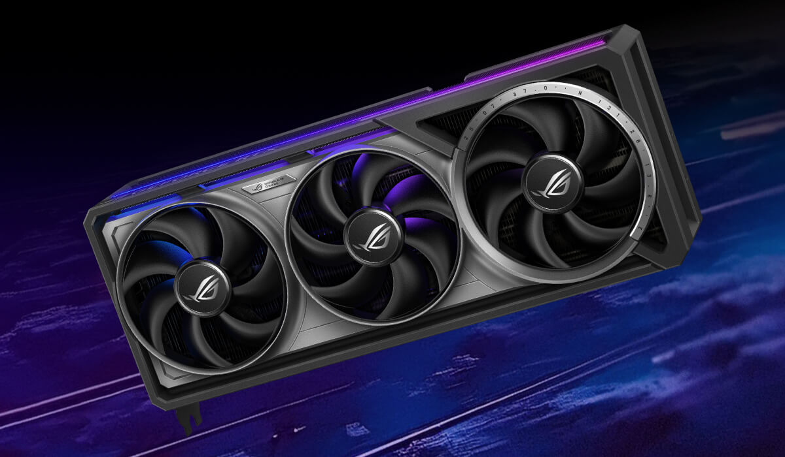

# ASUS ROG Astral GeForce RTX™ 5090 32GB GDDR7 OC Edition

## Details
- **Link:** [Product Page]()
- **Price:** S$XXX (from [amazon link](url))

## Why Selected
- 4 Fan Design allows for good cooling
- Most high-end GeForce RTX GPU for desktops
- Aesthetics

## Specifications
- VRAM: 32GB GDDR7
- NVIDIA® CUDA® Cores: 21,760
- Tensor Cores: 5th Generation
- Ray Tracing Cores: 4th Generation
- AI TOPS: 3593
- TDP: 575W
- Outputs: 3 x DP 2.1b, 1 x HDMI 2.2

---

## Considered Competitors

### NVIDIA RTX PRO 6000 Blackwell Workstation Edition
- **Link:** https://www.nvidia.com/en-in/products/workstations/professional-desktop-gpus/rtx-pro-6000/
- **Price:** S$12000 (approximate)
- **VRAM:** 96GB GDDR7
- **NVIDIA® CUDA® Cores:** 24,064
- **Tensor Cores:** 5th Generation
- **Ray Tracing Cores:** 4th Generation
- **AI TOPS:** 4000
- **TDP:** 600W
- **Pros:** 96GB of VRAM lets it run huge AI models without compression
- **Cons:** Too expensive and difficult to obtain for a personal AI machine
- **Reasoning:** Too expensive and overkill for personal AI machine

---

## Template for Additional Competitors

### [Competitor Name]
- **Link:**
- **Price:**
- **VRAM:**
- **Base/Boost Clock:**
- **TDP:**
- **Pros:**
- **Cons:**
- **Reasoning:**
