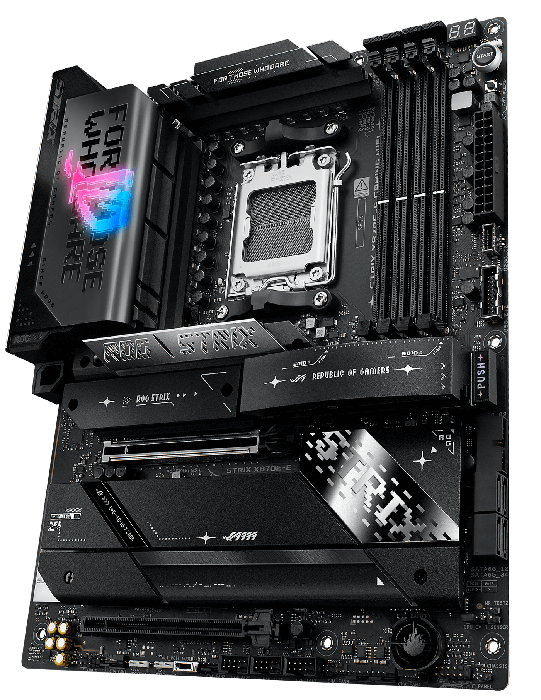

# ASUS ROG STRIX X870E-E GAMING WIFI

## Details
- **Link:** [Product Page](https://rog.asus.com/sg/motherboards/rog-strix/rog-strix-x870e-e-gaming-wifi/)
- **Price:** S$900 (from [dynacore](https://dynacoretech.com/asus-rog-strix-x870e-e-gaming-wifi-motherboard-3y-blt))

## Why Selected
- High performance and reliablity
- Multiple I/O ports, WiFi 7
- Enhanced cooling solutions

## Specifications
- Chipset: AMD X870E
- Socket: AM5
- Form Factor: ATX
- RAM Slots: 4 x DDR5 (Max 256GB)
- I/O:
    - 2 x USB4® (40Gbps) ports (2 x USB Type-C®)
    - 1 x USB 20Gbps port (1 x USB Type-C® with up to 30W PD Fast-charge)
    - 10 x USB 10Gbps ports (9 x Type-A + 1 x USB Type-C®)
    - 1 x HDMI™ port
    - 1 x Wi-Fi Module
    - 1 x Realtek 5Gb Ethernet
    - 2 x Gold-plated audio jacks 
    - 1 x Optical S/PDIF out port
    - 1 x BIOS FlashBack™  button 
    - 1 x Clear CMOS button

---

## Considered Competitors

### MSI MEG X870E GODLIKE
- **Link**: [Product Page](https://www.msi.com/Motherboard/MEG-X870E-GODLIKE)
- **Price:** S$1600 (from [dynacore](https://dynacoretech.com/parts-and-accessories/diy-components/motherboard/msi-meg-x870e-godlike-am5-e-atx-motherboard-3yrs-by-corbell-4711377276221))
- **Chipset:** X870
- **Socket:** AM5
- **Form Factor:** E-ATX
- **Pros:** Clean design, information panel on the motherboard itself, and LOTS of I/O ports
- **Cons:** Price is WAYY too high
- **Reasoning:** For the price it is not worth it

---

## Template for Additional Competitors

### [Competitor Name]
- **Link**: [Product Page](#)
- **Price:**
- **Chipset:**
- **Socket:**
- **Form Factor:**
- **Pros:**
- **Cons:**
- **Reasoning:**
