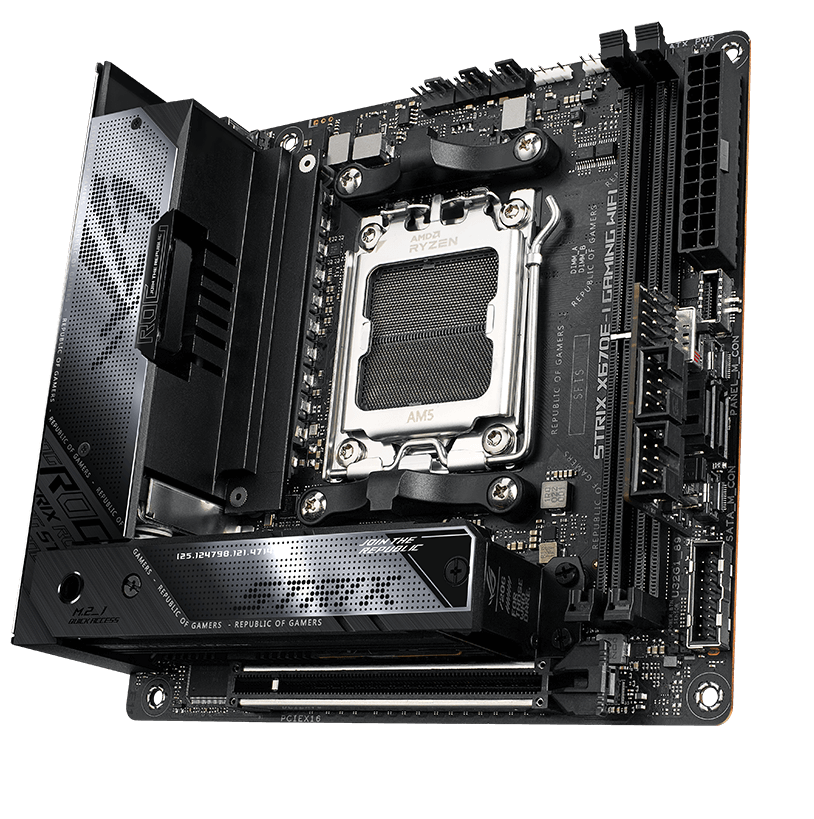

# ASUS ROG STRIX X670E-I GAMING WIFI

## Details
- **Link:** [Product Page](https://rog.asus.com/sg/motherboards/rog-strix/rog-strix-x670e-i-gaming-wifi-model/)
- **MSRP (Converted to SGD):** $603.56

## Why Selected
- It looks amazing
- High number of I/O ports for maximum connectivity

## Specifications
- Chipset: AMD X670
- Socket: AM5
- Form Factor: Mini-ITX
- RAM Slots: 2 (Max 96GB)
- Expansion: 1 x PCIe 5.0 x16 slot(s)
- I/O:
    - 2 x USB4® port(s) with Intel® JHL8540 USB4®
controller (2 x USB Type-C®) 
    - 5 x USB 3.2 Gen 2 port(s) (5 x Type-A) (1 port supports ROG STRIX HIVE)
    - 3 x USB 2.0 port(s) (3 x Type-A) 
    - 1 x HDMI® port
    - 1 x Wi-Fi Module
    - 1 x Intel® I225-V 2.5Gb Ethernet port

---

## Considered Competitors

### GIGABYTE X870I AORUS PRO ICE (rev. 1.1)
- **Link**: [Product Page](https://www.gigabyte.com/Motherboard/X870I-AORUS-PRO-ICE-rev-11)
- **MSRP (Converted to SGD):** $385.22
- **Chipset:** X870
- **Socket:** AM5
- **Form Factor:** Mini-ITX
- **Pros:** WiFi 7 support, low price for a high-end Mini-ITX motherboard
- **Cons:** Not an extensive number of I/O ports
- **Reasoning:** Good motherboard overall but lacking I/O ports

---

## Template for Additional Competitors

### [Competitor Name]
- **Link**: [Product Page](#)
- **MSRP (Converted to SGD):**
- **Chipset:**
- **Socket:**
- **Form Factor:**
- **Pros:**
- **Cons:**
- **Reasoning:**
